# Old protocol, new tricks: Learning vintage HTTP to ship modern AI.

"Tokens per second" sounds impressive, but attention spans are measured in milliseconds. Agentic workflows unlock powerful new capabilities, and interminable wait times. Fortunately, HTTP streaming, a dial-up relic, can incrementally reveal progress.

We'll resurrect HTTP features that have been dormant in our typical React+API+DB stack, and discover how they can enhance modern user experience.

## Outline

1. **What's the problem?**

   - Tokens-per-second is actually a long time to wait
   - Agentic chains ⇒ from 10s to multiple minutes of latency

2. **The One-Chunk Mindset**

   - How we got here: ASP.NET MVC, AJAX+JSON, SPA loaders, etc..
   - .NET Demo - Full-page HTML and/or text response

3. **HTTP Streaming Primer**

   - .NET Demo: HTML streamed line-by-line
   - History sidebar: 1997 HTTP/1.1 chunked transfer & 2009 SSE
   - .NET Demo: Plain-text stream
   - .NET Demo: Streaming LLM tokens to client

4. **Advanced Streaming Techniques**

   - Discuss streaming challenges of sophisticated agentic workflows
     - Multiple LLM calls to merge into single stream
     - Want to stream more than just LLM tokens, progress updates, tool calls, arbitrary data etc...
   - Demo: SSE to stream arbitrary stuff like logs, data, tool calls, llm events

> All concepts will be explained through barebones .NET Core Minimal API examples.

## Key Concepts

- **Streaming HTTP**: Responding in chunks, not all at once. But in ways the browser can understand, and incrementally render.
- **Server-Sent Events**: A long running one-way that the server can use to push events to the client.

## Getting Started

```bash
dotnet run
```

## Handling Streams Client-Side

Things start exactly as we are used to, a `fetch` request to our API.

```javascript
const response = await fetch("/api/chat", {
  method: "POST",
  body: JSON.stringify({ message: "Hello AI!" }),
  headers: { "Content-Type": "application/json" },
});
```

From here, we typically something like `let data = await response.json()` to get the final API response:

```mermaid
gantt
    title Traditional API Request
    dateFormat X
    axisFormat %L ms

    section fetch -> resp.json()
    API Response     :crit, json1, 0, 100
    Update UI           :active, json2, 100, 105
```



But in the browser, handling a stream requires a bit of extra work.

```mermaid
gantt
    title Streaming with Progressive UI Updates
    dateFormat X
    axisFormat %L ms

    section fetch -> Stream Reader
    Chunk 1             :crit, chunk1, 0, 20
    Update UI           :active, proc1, 20, 25
    Chunk 2             :crit, chunk2, 20, 40
    Update UI           :active, proc2, 40, 45
    Chunk 3             :crit, chunk3, 40, 60
    Update UI           :active, proc3, 60, 65
    Chunk 4             :crit, chunk4, 60, 80
    Update UI           :active, proc4, 80, 85
    Final Chunk         :crit, chunk5, 80, 100
    Update UI           :active, proc5, 100, 105
```



Process chunks as they arrive. Enables progressive rendering and better user experience for long responses. More code but much better UX.

1. Make the `fetch` request like typical
2. Read the fetch response in chunks, for each chunk, update the UI.

```ts
// The 'response' comes from the shared fetch setup above
const reader = response.body.getReader();
const decoder = new TextDecoder();

try {
  while (true) {
    // Read each chunk as it arrives
    const { done, value } = await reader.read();
    if (done) break;

    const chunk = decoder.decode(value, { stream: true });
    console.log("Received chunk:", chunk);

    // Update UI immediately with each chunk
    appendAIResponse(chunk);
  }
} finally {
  reader.releaseLock();
}
```

## Cross Compatibility

The nice thing is that generally both the server and client can handle both approaches in a cross-compatible way.

| Server Response     | Client: `await response.text()`                                           | Client: Stream Reader                                   |
| ------------------- | ------------------------------------------------------------------------- | ------------------------------------------------------- |
| **One Big Chunk**   | ✅ Works perfectly<br/>_Gets complete response at once_                   | ✅ Works perfectly<br/>_Reads single chunk then ends_   |
| **Streamed Chunks** | ✅ Works perfectly<br/>_Waits for all chunks, then returns complete text_ | ✅ Works perfectly<br/>_Reads each chunk as it arrives_ |

**Key Insight**: HTTP streaming is backwards compatible! You can:

- Fetch a stream and load the whole thing as a single chunk
- Create a client-side stream reader that works even if server responds in one big chunk

```mermaid
gantt
    title Network Waterfall: Client Processing Patterns
    dateFormat X
    axisFormat %L ms

            section Option A: Full Response + resp.text()
    Server Response         :crit, big1, 0, 100
    Update UI               :active, big2, 100, 105

    section Option B: Full Response + Stream Reader
    Server Response         :crit, big3, 0, 100
    Update UI               :active, big4, 100, 105

    section Option C: Streaming + resp.text()
    Chunk 1                :crit, stream1, 0, 20
    Chunk 2                :crit, stream2, 20, 40
    Chunk 3                :crit, stream3, 40, 60
    Chunk 4                :crit, stream4, 60, 80
    Final Chunk            :crit, stream5, 80, 100
    Update UI              :active, stream6, 100, 105

    section Option D: Streaming + Stream Reader
    Chunk 1             :crit, chunk1, 0, 20
    Update UI           :active, proc1, 20, 25
    Chunk 2             :crit, chunk2, 20, 40
    Update UI           :active, proc2, 40, 45
    Chunk 3             :crit, chunk3, 40, 60
    Update UI           :active, proc3, 60, 65
    Chunk 4             :crit, chunk4, 60, 80
    Update UI           :active, proc4, 80, 85
    Final Chunk         :crit, chunk5, 80, 100
    Update UI           :active, proc5, 100, 105
```



## Other topics/caveats/gotchas

- Streaming JSON is not a simple thing
- Streaming gotchas around caching and proxies
- Server sent events and EventSource, but only supports GET requests
